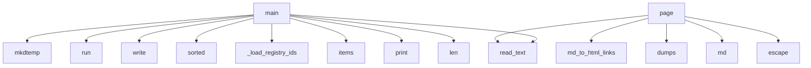

# System Architecture Analysis
<!-- generated in 0.00s -->

## Overview

- **Project**: /home/tom/github/if-uri/docs
- **Primary Language**: python
- **Languages**: python: 3, shell: 2, yaml: 2, txt: 1
- **Analysis Mode**: static
- **Total Functions**: 6
- **Total Classes**: 0
- **Modules**: 9
- **Entry Points**: 3

## Architecture by Module

### scripts.build_site
- **Functions**: 3
- **File**: `build_site.py`

### scripts.check_node_types
- **Functions**: 2
- **File**: `check_node_types.py`

### scripts.check_site
- **Functions**: 1
- **File**: `check_site.py`

## Key Entry Points

Main execution flows into the system:

### scripts.check_site.main
- **Calls**: tempfile.mkdtemp, subprocess.run, sys.stdout.write, sorted, sorted, print, sys.stderr.write, print

### scripts.check_node_types.main
- **Calls**: scripts.check_node_types._load_registry_ids, NODE_TYPES_MD.read_text, aliases.items, print, len, print, print, print

### scripts.build_site.page
- **Calls**: scripts.build_site.md_to_html_links, json.dumps, scripts.build_site.md, None.read_text, html.escape, html.escape, html.escape, html.escape

## Process Flows

Key execution flows identified:

### Flow 1: main
```
main [scripts.check_site]
```

### Flow 2: page
```
page [scripts.build_site]
  └─> md_to_html_links
  └─> md
```

## Data Transformation Functions

Key functions that process and transform data:

## Public API Surface

Functions exposed as public API (no underscore prefix):

- `scripts.build_site.md` - 60 calls
- `scripts.check_site.main` - 26 calls
- `scripts.check_node_types.main` - 11 calls
- `scripts.build_site.page` - 8 calls
- `scripts.build_site.md_to_html_links` - 1 calls

## System Interactions

How components interact:



## Reverse Engineering Guidelines

1. **Entry Points**: Start analysis from the entry points listed above
2. **Core Logic**: Focus on classes with many methods
3. **Data Flow**: Follow data transformation functions
4. **Process Flows**: Use the flow diagrams for execution paths
5. **API Surface**: Public API functions reveal the interface

## Context for LLM

Maintain the identified architectural patterns and public API surface when suggesting changes.